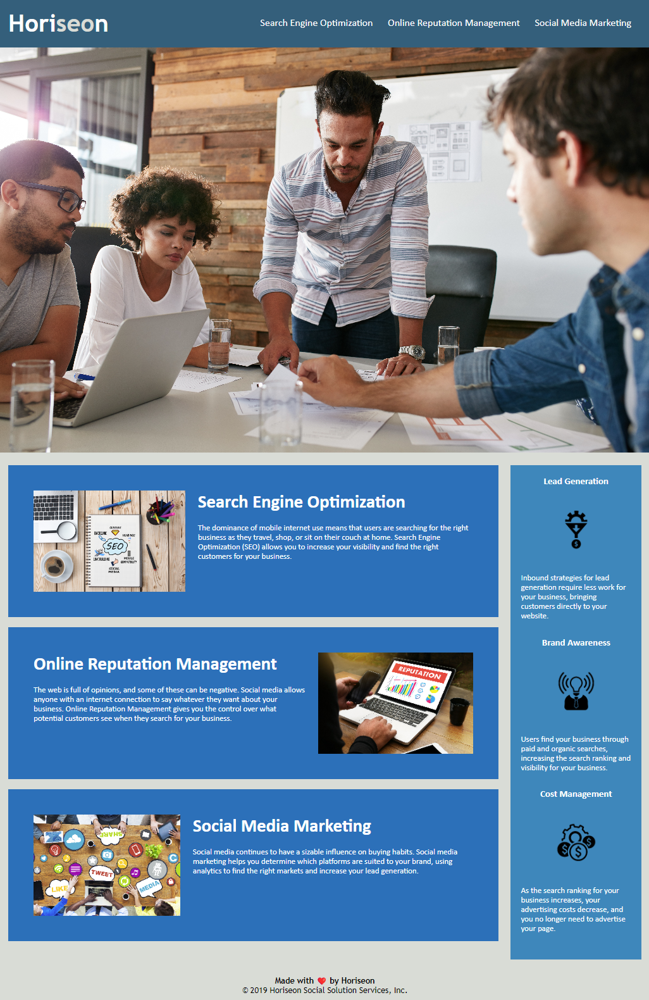

# Horiseon Marketing Agency Website Refactor
Website code refactor for marketing agency to improve accessibility functionality.

## About this project
Tasked by Horiseon Marketing Agency to refactor thier website and focus on accessibility improvement. This includes but not limited to the below items:

+ Semantic improvements of HTML elements
+ Improving the logical structure which is independent of styling and positioning. 
+ Adding descriptive 'alt' attributes to all images and icon elements.
+ Updating Heading elements to follow a sequential order
+ Add a concise and descriptive title to the webpage.


## Example of some HTML code changes

+ ### Introduced \<nav\> element to define the navigational links

 Old html code snippet

``` html
    <div>
        <ul>
            <li>
                <a href="#search-engine-optimization">Search Engine Optimization</a>
            </li>
            <li>
                <a href="#online-reputation-management">Online Reputation Management</a>
            </li>
            <li>
                <a href="#social-media-marketing">Social Media Marketing</a>
            </li>
        </ul>
    </div>
```

Updated html code snippet
``` html
    <nav>
        <ul>
            <li>
                <a href="#search-engine-optimization">Search Engine Optimization</a>
            </li>
            <li>
                <a href="#online-reputation-management">Online Reputation Management</a>
            </li>
            <li>
                <a href="#social-media-marketing">Social Media Marketing</a>
            </li>
        </ul>
    </nav>
```

+ ### Added \<article\> elements to define independent, self-contained content

Old html code snippet
``` html
    <div class="search-engine-optimization">  
        <h2>Search Engine Optimization</h2>
            <p>
                The dominance of mobile internet use means that users are searching for the right business as they travel, shop, or sit on their couch at home. Search Engine Optimization (SEO) allows you to increase your visibility and find the right customers for your business.
            </p>
    </div>
```

Updated html code snippet

``` html
    <article class="search-engine-optimization">  
        <h2>Search Engine Optimization</h2>
            <p>
                The dominance of mobile internet use means that users are searching for the right business as they travel, shop, or sit on their couch at home. Search Engine Optimization (SEO) allows you to increase your visibility and find the right customers for your business.
            </p>
    </article>
```

+ ### Added \<footer> element

Old html code snippet
``` html
    <div class="footer">
        <h4>Made with ❤️️ by Horiseon</h4>
        <p>
           © 2019 Horiseon Social Solution Services, Inc.
        </p>
    </div>
```

Updated html code snippet
``` html
    <footer>
        <h4>Made with ❤️️ by Horiseon</h4>
        <p>
            © 2019 Horiseon Social Solution Services, Inc.
        </p>
    </footer>
```

## Example of some CSS code changes
+ ### Consolidated selector with identical properties and values.

Old CSS code snippet
``` css
    .benefit-lead h3 {
    margin-bottom: 10px;
    text-align: center;
    }

    .benefit-brand h3 {
        margin-bottom: 10px;
        text-align: center;
    }

    .benefit-cost h3 {
        margin-bottom: 10px;
        text-align: center;
    }

    .benefit-lead img {
        display: block;
        margin: 10px auto;
        max-width: 150px;
    }

    .benefit-brand img {
        display: block;
        margin: 10px auto;
        max-width: 150px;
    }

    .benefit-cost img {
        display: block;
        margin: 10px auto;
        max-width: 150px;
    }
```

Updated CSS code snippet
``` css

    .benefit-lead h3, .benefit-brand h3, .benefit-cost h3 {
        margin-bottom: 10px;
        text-align: center;
    }
    .benefit-lead img, .benefit-brand img, .benefit-cost img {
    display: block;
    margin: 10px auto;
    max-width: 150px;
}

```

### Website preview after Refactor
